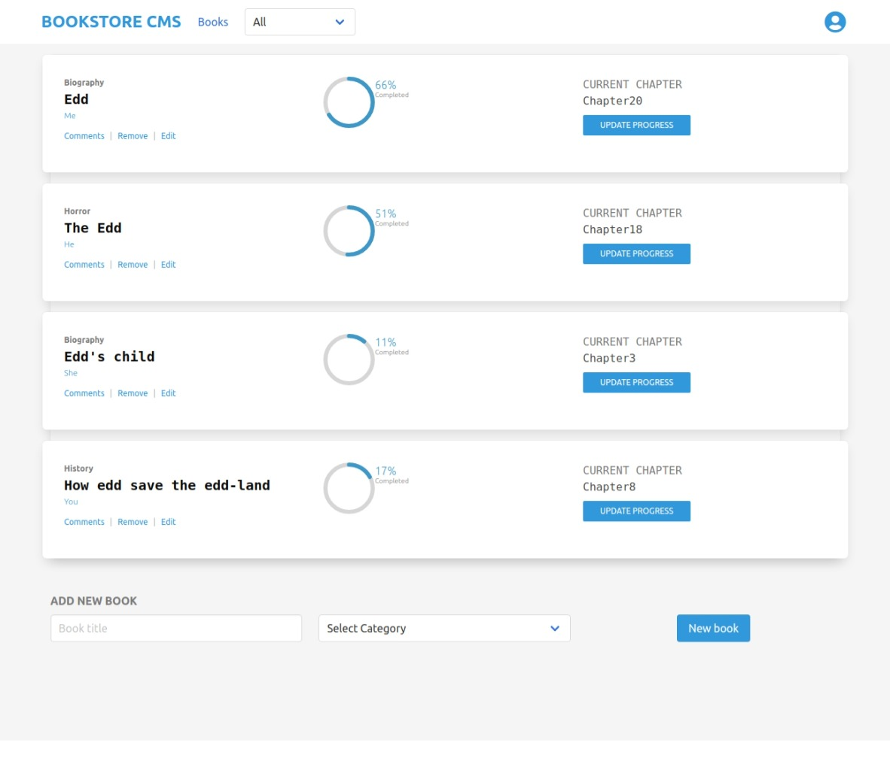

## Bookstore
This is a front-end application that will help organize and manage a bookstore. this app is  fast, dynamic and responsive is built with React & Redux.

You are able to create book registers, with: the title, author, category, number of chapters of the book and your current progress.

And you will see this info and your percentage progress.



## Live demo

[demo](https://nameless-dusk-00402.herokuapp.com/)
# Getting Started with Create React App

## Built with

- JavaScript
- React
- Redux


## Getting Started

To get a local copy of this project running follow these simple steps.

1. Clone this repository
 ```
 1 | git clone <repo>
 ```

2. To set Webpack and the dependencies run the command
 ```
 1 | npm install
 ```
- Use your favorite browser to open the index.html file (located at the dist page)

3. If you have node.js installed and all the dependencies were installed successfully, you can run the following command to start the server where the project will run.

```
1 | npm start
```

Runs the app in the development mode.\
Open [http://localhost:3000](http://localhost:3000) to view it in the browser.

The page will reload if you make edits.\
You will also see any lint errors in the console.

### Deployment

To deploy it, you can use Heroku. 
1. First you will need a Heroku account and set-up for deployment.

1.1 Go to the [heroku website](https://www.heroku.com/) and create an account using the same email address you used for GitHub and Git.

1.2. Run this command 
  ```
  1 | curl https://cli-assets.heroku.com/install.sh | sh
  ```
1.3. Run this command
  ```
  1 | heroku keys:add
  ```
press y and then Enter, and now, type in the email address you used to create your Heroku account and press Enter. Then, type in the password for your Heroku account. Next, press y and Enter to allow Heroku to upload your public SSH key.
1.4. The terminal may read Invalid credentials provided. Just press any key and the Heroku website will open in your browser. Log in with the information you created your account with, and the terminal will reappear and accept your public SSH key.

2. Once you complete the first step.
2.1. Run this command
``` 
1 | heroku create
```
2.2. Then run
```
1 | git remote
```
Check that you see heroku in the output.
2.3. Push to heroku typing 
```
1 | git push heroku HEAD:master
```
2.4. Enjoy this app
```
1 | heroku open
```
## Author

**Gustavo Sanmartin** :bird:
- GitHub: [@gasb150](https://github.com/gasb150)
- LinkedIn: [Gustavo Sanmartin](https://www.linkedin.com/in/gustavsanmartin/)

**Eduardo Baeza**
- GitHub: [@edxco](https://github.com/edxco/)
- Twitter: [@lalo_nbc](https://twitter.com/lalo_nbc/)
- LinkedIn: [eduardo-n-baeza](https://www.linkedin.com/in/eduardo-n-baeza/)

## 🤝 Contributing

Contributions, issues, and feature requests are welcome!

Feel free to check the [issues page](issues/).

## Show your support

Give a ⭐️ if you like this project!

## Acknowledgments

- Microverse


## 📝 License

<p>This project is <a href="LICENSE">MIT</a> licensed.</p>